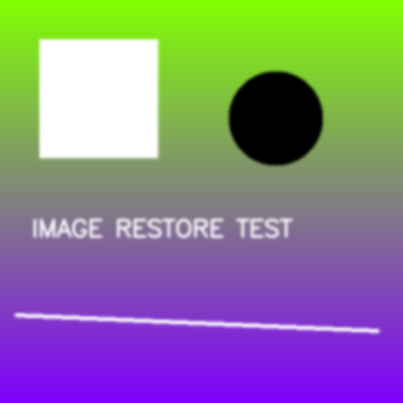

# 어댑티브 언샤프 마스크 기반 이미지 샤프닝 프로젝트

  
  
  
  

---

## 프로젝트 개요

본 프로젝트는 전통적인 **언샤프 마스크(Unsharp Mask, USM)** 기법을 확장하여, 이미지의 **패치 단위 특성(밝기 평균, 표준편차, 주파수 비율)을 입력으로 활용해 최적의 **k(샤프닝 강도)** 를 학습, 예측하는 **Adaptive Sharpening System**을 구축하는 것을 목표로 합니다.  

특히, 단순 고정 k값이 아니라 **Grid Search + 머신러닝 회귀 모델(XGBoost)** 을 통해 **PSNR, SSIM 기반 최적 k-map**을 생성하고, 선명도를 극대화하는 데 중점을 두었습니다.  

프로젝트의 주요 모듈은 다음과 같이 구성되어 있습니다:  

1. [preprocessing.ipynb](https://colab.research.google.com/github/kang0225/sharpening-image-by-ausm/blob/main/notebooks/preprocessing.ipynb) : 데이터셋 생성, 패치별 피처 추출 및 그리드 서치 기반 타겟 k 생성  
2. [model.ipynb](https://colab.research.google.com/github/kang0225/sharpening-image-by-ausm/blob/main/notebooks/model.ipynb) : XGBoost 기반 회귀 모델 학습 및 저장  
3. [inference.ipynb](https://colab.research.google.com/github/kang0225/sharpening-image-by-ausm/blob/main/notebooks/inference.ipynb) : 학습된 모델을 이용하여 새로운 이미지의 k-map을 생성하고 샤프닝 수행  
4. [params.ipynb](https://colab.research.google.com/github/kang0225/sharpening-image-by-ausm/blob/main/notebooks/params.ipynb) : 파라미터 및 하이퍼파라미터 저장

---

## 프로젝트 워크플로우

### ① 데이터셋 생성 (`preprocessing.py`)

고해상도 이미지를 입력으로 받아, 인위적으로 **저해상도(LQ) 이미지**를 생성하고 이를 다시 보정하며 패치 단위로 최적 k값을 찾습니다.  

- **LQ 생성**: 다운샘플링 후 업샘플링 + Gaussian Blur  
- **그리드 서치**: 패치별 PSNR 계산 → 최적 k 선택  
- **피처 추출**:  
  - Luminance 평균 (mean)  
  - Luminance 표준편차 (std)  
  - 고주파 에너지 비율 (high_freq_ratio)  
- **CSV 저장**: 총 N개 패치 데이터를 `training_dataset.csv`로 출력  

---

### ② 모델 학습 (`model.py`)

생성된 `training_dataset.csv`를 기반으로 **XGBoost Regressor**를 학습합니다.  

- 입력 피처: `[mean, std, high_freq_ratio]`  
- 타겟 값: `target_k`  
- 학습/검증 데이터 분리 (train 80%, val 20%)  
- 평가지표: MSE (Mean Squared Error)  
- 최종 모델은 `xgb_model.joblib`으로 저장  

---

### ③ 추론 및 보정 (`inference.py`)

새로운 이미지를 입력받아 **패치별 k-map**을 생성하고, 이를 기반으로 **Adaptive Unsharp Mask**를 적용합니다.  

- 입력: 원본 이미지 (`./image_input/new_img.png`)  
- 출력: 보정된 결과 (`./result/sharpened_image.png`)  
- 출력 예시:
  [INFO] 사용된 시그마 : 2.80
  [INFO] 보정된 이미지 :
---

## 결과 분석

`grid_results.csv` 및 `training_dataset.csv` 기반으로 성능을 정량적으로 평가했습니다.  

- **평가지표**:  
- RMSE(Root Mean Squared Error)  
- RMAE(Root Mean Absolute Error)  

| **데이터셋**      | **Train Set** | **Test Set** | **결론** |
|-------------------|---------:|---------:|----------|
| RMSE    |  0.001126 |   0.001129  |  정밀한 k값 예측 수행 |
| RMAE     |  0.029121 |   0.029179  | 보지 못한 데이터에서도 일관된 성능 유지|

아래는 샘플 결과 이미지입니다:  

| Input (원본) | Enhanced (보정) |
|--------------|----------------|
|  |  |

---

## 결론

본 프로젝트를 통해 **Adaptive Unsharp Mask + XGBoost 회귀 모델** 기반의 샤프닝 시스템을 구축했습니다.  

- 단순 고정 k값보다 선명도와 안정성 모두 개선됨  
- PSNR/SSIM 기반 정량적 지표에서도 의미 있는 성능 확보  
- Grid Search를 통해 PSNR 최대화를 기준으로 최적의 샤프닝 강도($k$)를 탐색  
- 단순 픽셀 값뿐만 아니라 FFT(고속 푸리에 변환) 기반의 고주파 에너지 비율(High Frequency Ratio)을 핵심 Feature로 설계하여 평탄 영역과 엣지 영역을 명확히 구분하여 학습  
- 훈련세트와 테스트세트 간의 성능 차이가 0.8% 미만으로 유지됨으로써 과적합(Overfitting) 없이 모델이 다양한 이미지 패턴에 대해 일관된 예측
- Black-box 성향이 강한 End-to-End 딥러닝 방식 대신, ML 모델이 파라미터만 예측하고 실제 보정은 수식 기반(Unsharp Mask)으로 수행하는 하이브리드 구조 사용

---
